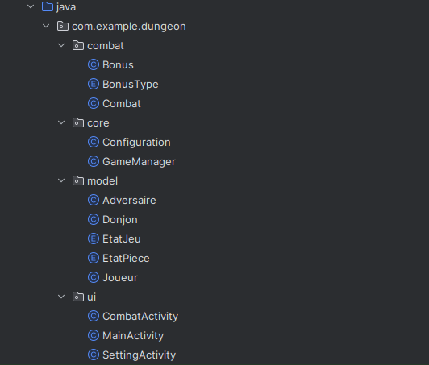
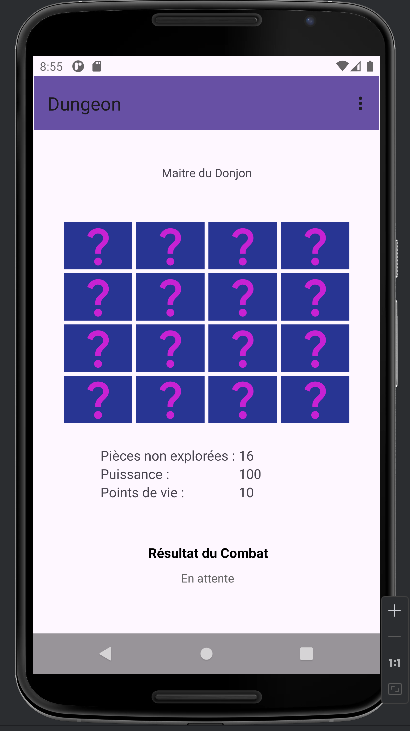
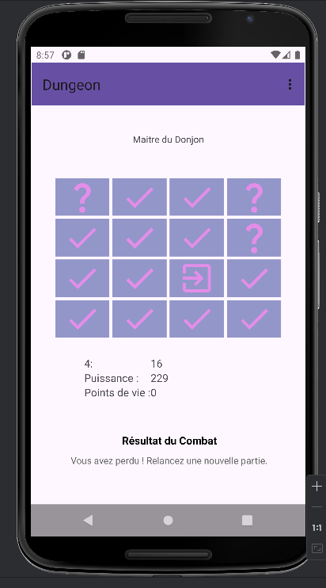
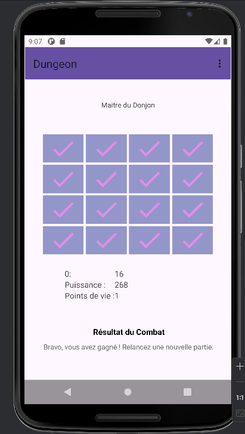
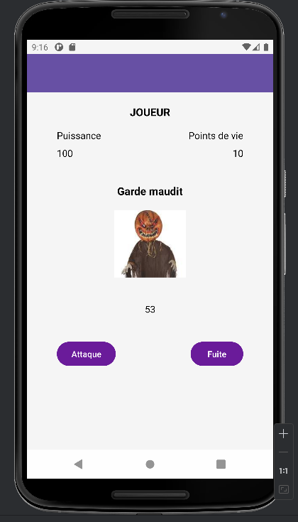

# Dungeon - Jeu d'exploration et de combat

## Description du projet

Dungeon est un jeu d'exploration et de combat où le joueur explore un donjon, affronte des adversaires et collecte des bonus. Le jeu est conçu sous Android avec une architecture bien organisée pour séparer la logique du jeu, l'affichage et les données.

## Fonctionnalités principales

### 1. Exploration des pièces

- Le donjon est composé de 16 pièces.
- Chaque pièce contient un adversaire et parfois un bonus .
- Les pièces peuvent être non explorées, explorées mais non terminées (défaite ou fuite), ou explorées et terminées (victoire).

### 2. Combat contre les adversaires

- Chaque pièce contient un adversaire avec une puissance aléatoire.
- Le joueur engage un combat contre l'adversaire.
- Le combat peut mener à une victoire, une défaite ou une fuite.
    - Une victoire permet de gagner en puissance et marque la pièce comme terminée.
    - Une défaite entraîne une perte de points de vie et laisse l'adversaire présent dans la pièce.
    - Une fuite entraîne une perte mineure de points de vie et laisse l'adversaire présent dans la pièce.

### 3. Gestion des bonus

- Deux pièces contiennent aléatoirement un bonus :
    - Une potion magique qui restaure entre 1 et 3 points de vie.
    - Un charme de puissance qui augmente la puissance du joueur de 5 à 10 points.
- Le bonus est attribué au joueur lorsqu'il explore la pièce, peu importe l'issue du combat.

### 4. Interface de combat

- Affichage d'une image unique pour tous les adversaires.
- Attribution d'un nom aléatoire à chaque adversaire.
- Un affichage du combat avec les statistiques du joueur et de l'adversaire.

### 5. Gestion des paramètres de jeu

- Un menu de configuration permet de modifier avant le début de la partie :
    - La puissance initiale du joueur.
    - Les points de vie initiaux du joueur.
    - La puissance maximale des adversaires.
- Les paramètres définis sont appliqués à la partie en cours.

## Structure du projet

Le projet est organisé en plusieurs packages pour assurer une séparation claire des responsabilités.

## Vue de l'application

- **📂 ui** : Contient les activités liées à l'interface utilisateur.
- **📂 core** : Gère la logique globale du jeu.
- **📂 model** : Regroupe les classes représentant les entités du jeu.
- **📂 combat** : Contient la logique de combat et de gestion des bonus.

## Explication des classes principales

### `GameManager.java`

- Singleton qui gère l'état global du jeu.
- Vérifie si le joueur a gagné ou perdu.
- Gère la réinitialisation du jeu.

### `Donjon.java`

- Gère les pièces, leurs états et la présence d'adversaires et de bonus.
- Permet de récupérer l'état d'une pièce.

### `Joueur.java`

- Contient les statistiques du joueur (points de vie, puissance).
- Permet de gagner de la puissance et de récupérer des points de vie.

### `Combat.java`

- Gère la logique des combats entre le joueur et un adversaire.
- Applique les effets des victoires, défaites et fuites.
- Vérifie si un bonus est disponible et l'applique au joueur.

### `Bonus.java` & `BonusType.java`

- Définit les différents types de bonus et leurs effets.

## Interface utilisateur

### 1. Écran principal (`MainActivity`)

- Affiche la grille des pièces du donjon.
- Affiche les statistiques du joueur.
- Indique le dernier résultat de combat.

### 2. Écran de combat (`CombatActivity`)

- Affiche l'adversaire avec un nom et une image.
- Permet au joueur de combattre ou de fuir.
- Gère les résultats du combat.

### 3. Écran des paramètres (`SettingActivity`)

- Permet de modifier les paramètres avant le début d'une partie.
- Les valeurs sont appliquées uniquement au démarrage du jeu.

## Installation et exécution

### Prérequis

- Android Studio installé
- Un émulateur ou un appareil Android physique

### Quelques vues de l'application

le symbole ✓ dans une pièce indique que le joueur a vaincu le combat.
le symbole ? dans une pièce indique que le joueur n'a pas encore exploré cette pièce.
Le symbole à flèche sortante (➜) suggère une action possible, une zone à explorer . le joueur a fui cette pièce ou a perdu son combat là. 

